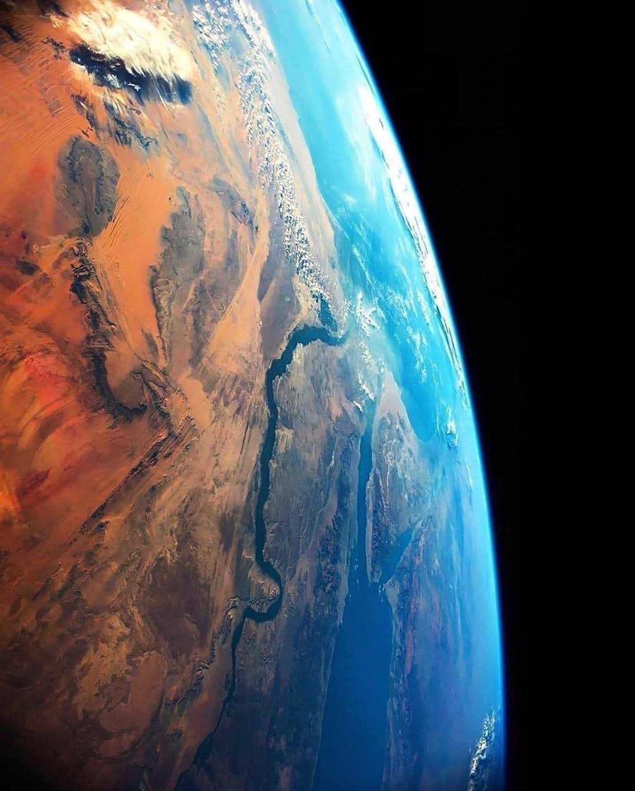

## Qué se puede entender como Ciencia de Datos Marinos (CDM)?

CDM puede considerarse como una **ciencia de interfaz**, es decir, la intersección de 2 disciplinas (estudio de datos y los sistemas de la tierra) que permite intervenir en campos con enfoques conceptuales distintos y extender el espacio de acción e investigación. 

Los científicos marinos tienen poca o ninguna capacitación formal en métodos de ciencia de datos, como lo pueden ser los algoritmos de aprendizaje automático (machine learning). 

Por otro lado, los data scientist carecen de los conocimientos formales oceanográficos, químicos o biológicos. Al fusionar la experiencia disciplinaria en la **ciencia de datos marinos**, ambos grupos pueden aprovechar las ventajas mutuas y proporcionar conocimiento de alto nivel a partir de información compleja.

Por esta razón la CDM se puede abordar desde dos perspectivas: desde un campo especializado en ciencias marinas con una expansión hacia metodologías de ciencia de datos o viceversa.

## La Heterogeneidad de los Datos Marinos

Los datos marinos forman la base y esencia de CDM, por este motivo es vital comprender su trasfondo. 

La heterogeneidad existente puede distinguirse por la experiencia disciplinaria o el contexto en que se generaron. Es por esto que se pueden clasificar en tres categorías:

- Datos de observación recopilados y preprocesados por los mismos investigadores, mediante dispositivos y protocolos de medición. Entre los más característicos están los capturados por barcos, amarres, planeadores, drones, vehículos submarinos autónomos, flotadores, boyas o cables ópticos.

- Los productos espacio-temporales altamente procesados. Las mediciones de teledetección que se validan con observaciones de campo son el principal ejemplo. Los algoritmos, modelos o redes neuronales sobre estos datos obtienen estimaciones de las propiedades del océano a gran escala.

- Los datos sintéticos de simulaciones que se generan a partir representaciones imperfectas del mundo real. Un ejemplo podrían ser las predicciones climáticas.

Existe también heterogeneidad de datos a partir de los niveles de procesamiento. Esto tiene que ver con la incertidumbre implícita, los pasos de tratamiento individual así como de sus suposiciones subyacentes. 

Los niveles de procesamiento pueden ser de: 

- nivel 0: que abarcan mediciones sin procesar, datos crudos.

- nivel 1: conjuntos de datos con cierto control de calidad. 

- nivel 2 o superior: derivados y productos de síntesis de modelos-algoritmos.  

## Consideraciones finales: CDM como campo emergente que necesita estabilizarse

Los grandes avances en la capacidad de observación automatizada/remota y la recopilación simultánea de datos cada vez más diversos, desafían los métodos convencionales de manejo de información. 

A medida que se mida y cartografíe una mayor parte del océano y que el modelado aumente en su complejidad, aumentará la necesidad de herramientas y métodos innovadores. 

>A pesar de los beneficios obvios de unir fuerzas de las ciencias marinas con la de datos, existen retos a superar.

Ya el primer paso está. La definición y educación de CDM. El cambio estructural es el segundo paso necesario y en el que podríamos estar. El apoyo a esta estructura puede provenir de la generación de nuevos proyectos, la asignación de puestos permanentes y las bases de un camino hacia una carrera académica. 

La demanda y las proyecciones a futuro son alentadoras. El reto radicará en encontrar un equilibrio entre la incorporación de experiencias de las ciencias parentales, la exploración de nuevas formas de combinación y su avance simultaneo.

*Artículo inspirado de: "Perspectives on Marine Data Science as a Blueprint for Emerging Data Science Disciplines". Verwega et al., 2021.*

