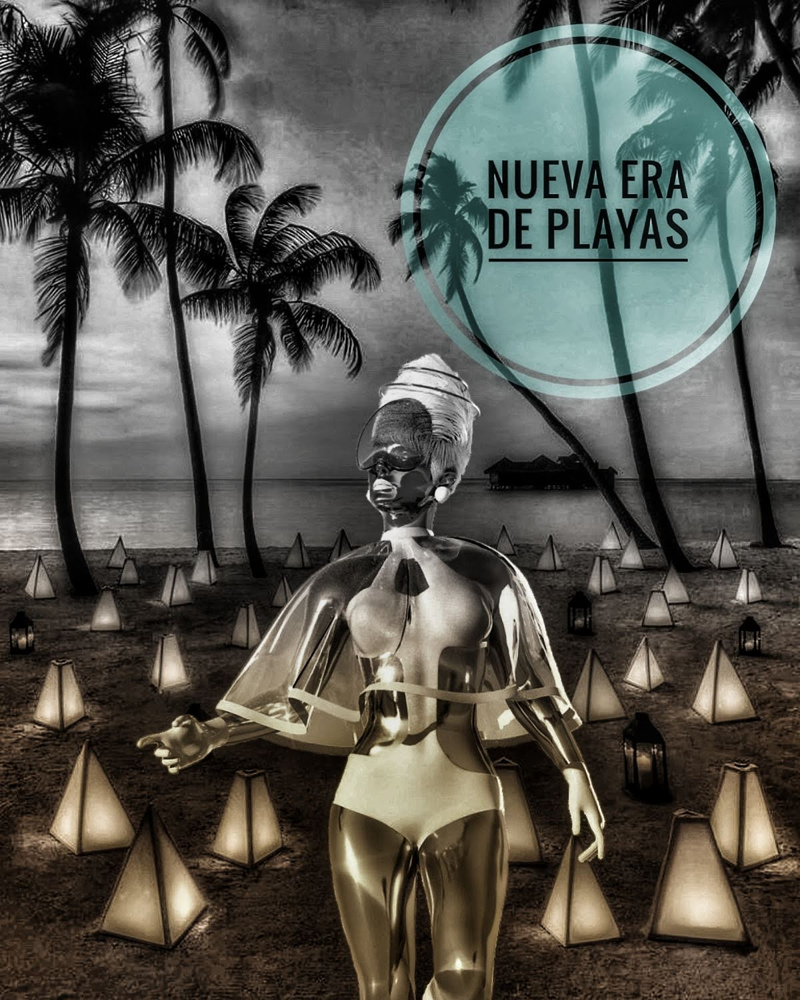

## Empecemos con algo de NLP...

El campo de NLP constituye un interés fundamental en el amplio espectro de la inteligencia artificial. Su estudio comprende teorías y métodos que permiten una comunicación efectiva entre humanos y máquinas.

Fundamentos de informática, ciencia, lingüística y matemáticas se agrupan con el objetivo principal de traducir lenguajes humanos (o naturales) en comandos que pueden ser ejecutados por computadoras.

## Hacia donde se está direccionando su investigación

Dado que los datos textuales se generan de manera ubicua con la forma actual en que se relacionan las personas o la infinidad de operaciones comerciales, la investigación NLP en diferentes disciplinas se centra en una variedad de temas y métodos analíticos.

Por ejemplo, el marketing tienden a utilizar NLP para capturar opiniones y comportamientos de los clientes. La contabilidad y las finanzas se centran en la extracción de información de las empresas (informes, patentes) para seguirlas con mayor precisión.

Las redes sociales son un común denominador en todos los ámbitos y la extracción de su información con los sentimientos que la acompañan son de extrema valía para comprender clientes, inversionistas, mercados o empresas. 

En términos generales los algoritmos de clasificación, el modelado de temas (topic modeling) y el análisis de sentimientos son los métodos más utilizados en la investigación.

## Y las Playas... 

Las playas y su gestión al igual que otros campos que empiezan a aplicar NLP están aprovechando los datos de las redes sociales para evaluar como las personas interactúan, piensan o se relacionan con estos lugares.

Los [análisis de sentimientos](https://grammaloreto.netlify.app/analisis-sent/) son la aplicación más común de examinar las actitudes y emociones de los visitantes hacia cierto punto del arenal, de algún servicio o experiencia.

[Ver Análisis de Sentimientos de Playas Latinoamericanas en GitHub](https://github.com/grammaloreto/BeachSentimentAnalysis)

Los datos generados a partir de las redes sociales pueden usarse para complementar otros enfoques para el monitoreo a gran escala de los paisajes costeros, incluida la identificación de áreas prioritarias para la gestión activa utilizando un enfoque rápido, remoto y de bajo costo.

Sin embargo hay mucho por hacer. Para playas que no cuentan con ningun tipo de lineamiento estandarizado o que genere algún tipo de certificación podría ser un buen piloto a incorporar.

A parte de la informacion generada en plataformas sociales, sería valioso incorporar otros tipos de análisis NLP en la gestion de playas.

Documentación de certificaciones (ISO, turísticas, destinos inteligentes) políticas de manejo, ley de costas, auditorías. Existen innumerables recursos de texto asociado que pueden brindar aplicaciones mas robusta y estables para este contexto.

El reto radica en 3 grandes puntos:
- Articulación
- Recopilacion de Datos
- Capacitación

Para muchos es una herramienta desconocida. Se necesita mas divulgación y comunicación entre aquellos que tengan alúun tipo de conocimiento relacionado. 

Es importante recopilar datos de calidad y aplicables. Al no encontrarse de forma convencional en la mayoría de casos, es importante saber hacia donde dirigir los esfuerzos.

Finalmente la capacitación del talento humano y los recursos físicos(computacionales, cámaras, sensores) que faciliten y generen calidad en los resultados, determinarán si el modelo NLP en la gestion de playas será exitoso, fallido, tomará de tiempo o nunca se dará.  

