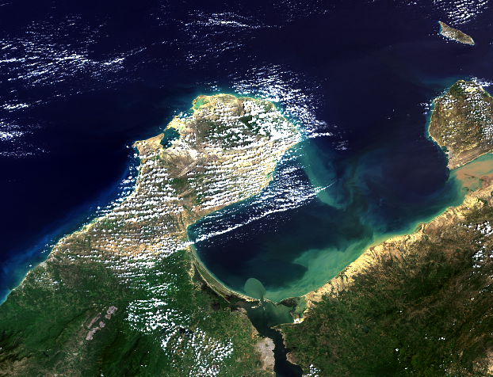

## Qué es Ocean Color?

Ocean Color es la rama de los estudios oceánicos que se centra específicamente en el color del agua y de la información que se puede obtener al observar sus variaciones.

Este campo se desarrolló junto con la teledetección (remote sensing) del agua, por lo que tiene su fundamento en los instrumentos satelitales y de aviones que miden el color.

## Por qué el mar es Azul? Qué otros colores son característicos?

El color azul del océano es el resultado de varios factores. En primer lugar, el agua absorbe preferentemente la luz roja, lo que significa que la luz azul permanece y se refleja fuera del agua. 

>La luz roja se absorbe más fácilmente y por lo tanto no alcanza grandes profundidades. La luz azul puede penetrar hasta los 200 metros. Las moléculas de agua y las partículas diminutas que conforman el océano (detritos) dispersan preferentemente la luz azul más que la de otros colores. 

Las algas microscópicas (fitoplancton) absorben la luz en las longitudes de onda azul y roja, debido a sus pigmentos específicos como la clorofila. En consecuencia, con más fitoplancton en el agua, el color cambia hacia la parte verde del espectro.

El océano se torna de color amarillo o marrón cuando hay grandes cantidades de sustancias disueltas, sedimentos o ambos tipos de material. Las sustancias disueltas (nutrientes) absorben la luz azul con más fuerza.

Finalmente el agua puede verse roja si hay florecimientos de algun tipo específico de fitoplancton que cause una decoloración de la superficie del mar. Estos eventos se denominan “mareas rojas”. Sin embargo, no todas las mareas rojas son dañinas y solo se consideran floraciones dañinas si el tipo de plancton involucrado contiene toxinas peligrosas.

## Tecnología Involucrada

Los sensores remotos (objetos que obtienen información de algún fenómeno sin tener contacto físico con este) de satélites, aviones y drones miden el espectro de energía luminosa que proviene de la superficie del agua. 

> Los sensores que se utilizan para medir la energía luminosa procedente del agua se denominan radiómetros (espectrómetros o espectro-radiómetros). 

Algunos radiómetros se utilizan en la superficie terrestre, en barcos o directamente en el agua (boyas). Otros están diseñados específicamente para aviones o misiones satelitales.

Debido al creciente interés por parte de investigadores y particulares, cada vez es más común el acceso a datos que brindan instrumentos satelitales y de estudios de la tierra.

Su fácil acceso, los periodos de tiempo prolongados de actividad, las grandes áreas que abarcan y las demas ventajas que proporcionan en comparación a los métodos *in situ*, los hacen ideales para establecer una nueva era de investigación en muchos campos.

Los sensores satelitales más conocidos para el estudio del color del océano 
son:

- MODIS (Moderate-resolution Imaging Spectroradiometer) de la NASA. Se encuentra en 2 satélites para brindar una mayor cobertura, AQUA y TERRA.

- OLCI (Ocean and Land Colour Instrument) de La Agencia Espacial Europea ESA. Está presente en el satélite Sentinel 3A y Sentinel 3B.

- VIIRS (Visible Infrared Imaging Radiometer Suite ) en Suomi-NPP (SNPP), un satélite norteamericano financiado por la NOOA o la Oficina Nacional de Administración Oceánica de Estados Unidos.

## Como acceder a los productos de estos satélites:

Son muchas las plataformas que proporcionan datos producidos por estos sensores. La información que almacenan estos dispositivos en un día es muy pesada (hablando en términos computacionales) por lo que hay que estar preparado con una memoria externa o una buena disponibilidad de almacenamiento en la nube.

Un lugar en el que se pueden manipular sin la necesidad de descargar ningún tipo de archivo es Google Earth Engine. En [este](https://grammaloretoblog.netlify.app/earth-engine/) artículo hablo un poco más al respecto.

El portal Ocean Color de la NASA dedicado exclusivamente al tema es muy completo con todos los productos y explicaciones.

Finalmente la ESA tiene sus propias herramientas. Puedes conocer más en este tutorial de como trabajar sus productos OLCI en este repositorio de [GitHub](https://github.com/grammaloreto/OceanColor).

